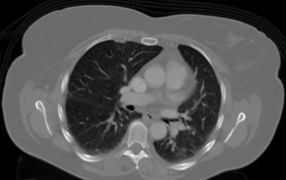

# Clasificación de Nódulos Pulmonares en Tomografías de Tórax

## Descripción

Este proyecto consiste en desarrollar un modelo de aprendizaje profundo capaz de **identificar la presencia de nódulos pulmonares** en imágenes de tomografía computarizada (CT-Scan) de tórax. El trabajo se enmarca dentro del proyecto final de la materia de **Visión por Computadora 2** (CEIA - FIUBA).

## Dataset

Se utilizará el siguiente dataset de Kaggle:

- **Nombre**: Chest CT-Scan Images Dataset  
- **Link**: [Chest CT-Scan images Dataset | Kaggle](https://www.kaggle.com/datasets/mohamedhanyyy/chest-ctscan-images)
- Este dataset contiene imágenes de tomografías de tórax, clasificadas por presencia o ausencia de nódulos pulmonares.

## Objetivo

Entrenar y evaluar modelos de clasificación de imágenes médicas para detectar automáticamente la **presencia de nódulos pulmonares**.  
Durante el trabajo se explorarán distintas arquitecturas de redes neuronales, técnicas de augmentación de datos, y el uso (o no) de transfer learning.

## Integrantes

- Diego Paciotti Iacchelli  
- Joaquín González  
- Pablo Gómez Verdini  

## Enunciado del Trabajo Final

Los requerimientos y entregables del trabajo se encuentran en el siguiente archivo:

[CONSINGA.md](./doc/CONSIGNA.md)

## Metodología
El informe del trabajo y los resultados se realizarán utilizando **Jupyter Notebooks**, los módulos de implementación principales
se importarán desde *librerías* ( en la carpeta *src/*) desarrollados especialmente para la resolución de este trabajo con el objetivo de mejorar el proceso
de desarrollo colaborativo, y la fácil lectura y seguimiento del trabajo.